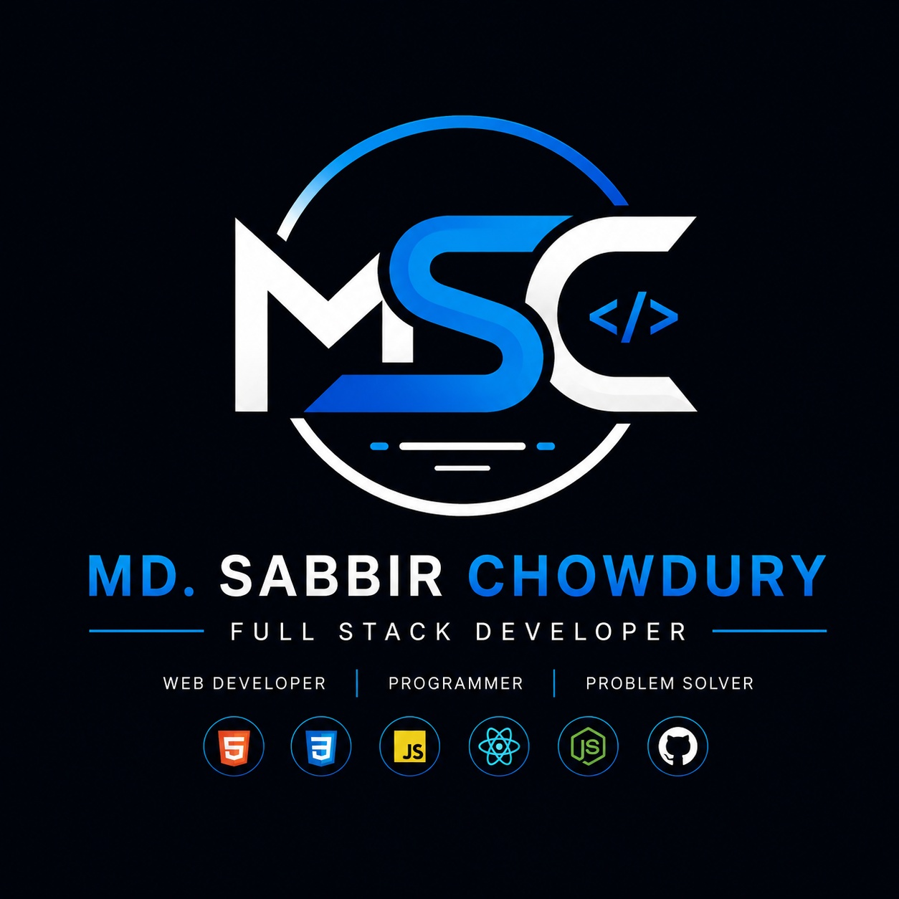

# 🚀 Sabbir Chowdhury - Portfolio

## 👨‍💻 About Me

Hi, I'm **Sabbir Chowdhury**.

I am a passionate **Web Developer, Graphics Designer and Digital Marketer**.
I create modern, responsive and user-friendly websites that help businesses
build their online presence.

## 🌐 Live Website

🔗 Portfolio:

https://scsabbir.github.io/portfolio/

## 🛠️ Skills

### Frontend Development

- HTML5
- CSS3
- JavaScript
- Responsive Design
- Bootstrap
- React JS

### Tools

- Git
- GitHub
- VS Code
- Figma

### Other Skills

- Graphics Design
- Digital Marketing
- SEO
- E-commerce Management

## 📂 Featured Projects

### 1. Personal Portfolio Website

A professional portfolio website designed for:

- Freelancing
- Upwork
- Fiverr
- LinkedIn
- Job Applications

### 2. Frozen Mart 360

A business website for frozen food products.

Features:

- Product showcase
- Responsive design
- Customer-friendly UI

### 3. Business Landing Page

Modern landing page focused on:

- Brand presentation
- Conversion optimization
- User experience

## ⚙️ Technologies Used

## 📱 Responsive Design

The website works perfectly on:

✅ Desktop

✅ Laptop

✅ Tablet

✅ Mobile

## 📸 Screenshots

Add screenshots here:

Examples:

- Home Page
- Projects
- Mobile View

## 📞 Contact Me

📧 Email:
yourmail@gmail.com

📍 Location:
Dhaka, Bangladesh

🔗 GitHub:

https://github.com/scsabbir

## ⭐ Support

If you like this project, don't forget to give it a ⭐ on GitHub.

## 📄 License

This project is created by Sabbir Chowdhury.

All rights reserved © 2026
